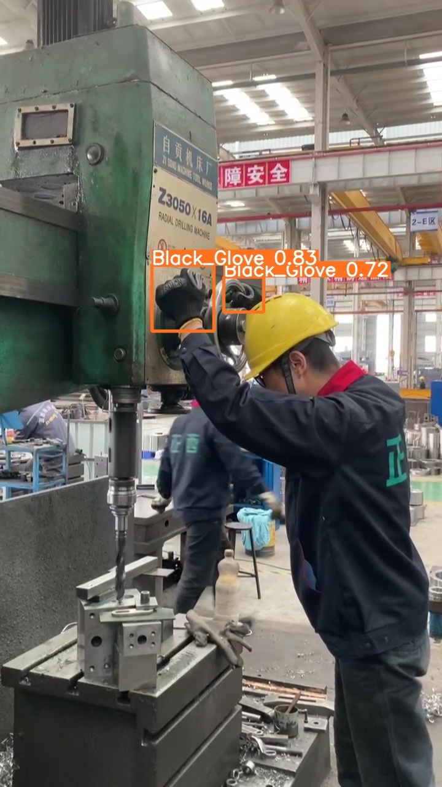

# Real-Times Glove Detection via Lightweight YOLOv3 with Enhanced Attention and Efficient IoU Loss
> Accurate and real-time glove detection is crucial for safeguarding worker safety in industrial environments. In this study, we present an enhanced glove detection network built upon a lightweight YOLOv3 architecture, incorporating a Convolutional Block Attention Module (CBAM) and the Efficient Intersection over Union (EIoU) loss function. These improvements resulted in significant gains, with a 3.4% increase in mAP50 and a 15.5% increase in mAP95, alongside a 30.9% acceleration in inference speed, a 54.65% reduction in parameters, and a 60.85% decrease in GFLOPS. Our method demonstrates improved efficiency and accuracy in real-time glove detection, contributing significantly to enhancing worker safety in industrial settings. The proposed approach was evaluated on a self-built glove dataset, outperforming several state-of-the-art object detection models.

## <div align="center">Performance</div>
### Structure of improved YOLOv3

<div align="center">
  
  <p><i>Figure 1：The improved structure of YOLOv3, which used GhostConv in the backbone, added CBAM to the neck and used EIoU as loss function.</i></p>
</div>

### Comparison with other real-time object detectors, the improved model achieve state-of-the-arts performance
<div align="center">
  
  <p><i>Figure 2：Comparison with other real-time object detectors, the improved model achieve state-of-the-arts performance.</i></p>
</div>

### Visual results of the Improved model
<div align="center">
  
  <p><i>Figure 3-a</i></p>
</div>

<div align="center">
  
  <p><i>Figure 3-b</i></p>
</div>

<div align="center">
  
  <p><i>Figure 3-c</i></p>
</div>

<div align="center">
  <table>
    <tr>
      <td align="center">
        
        <p><i>Figure 3-d</i></p>
      </td>
      <td align="center">
        
        <p><i>Figure 3-e</i></p>
      </td>
    </tr>
    <tr>
      <td align="center">
        
        <p><i>Figure 3-f</i></p>
      </td>
      <td align="center">
        
        <p><i>Figure 3-g</i></p>
      </td>
    </tr>
  </table>
</div>

### Visual comparison of improved model and original model: the improved model can detect the right gloves with the right number.

<div align="center">
  <table>
    <tr>
      <td align="center">
        
        <p><i>Figure 4-a: The improved model can detect the right number and position of the gloves</i></p>
      </td>
      <td align="center">
        
        <p><i>Figure 4-b: The default model detect the glove with wrong number and position</i></p>
      </td>
    </tr>
  </table>
</div>

<div align="center">
  
  <p><i>Figure 4-c: The improved model detects gloves with the rights number.</i></p>
</div>

<div align="center">
  
  <p><i>Figure 4-d: The default model detects 2 gloves as 1.</i></p>
</div>


### The effect of adding CBAM
As a result, the network gains a better understanding of the importance of different channels and positions within various feature maps. The channel attention mechanism allows the network to allocate weights based on the significance of each channel, helping it identify which channels are more critical. Additionally, through the spatial attention mechanism, the network can determine the importance of specific positions within the feature map, enabling it to focus on those areas. Figure below illustrates the heatmap changes in the image after the addition of CBAM.

<div align="center">
  
  <p><i>Figure 5-a: Heatmap of adding CBAM.</i></p>
</div>

<div align="center">
  
  <p><i>Figure 5-a: Heatmap of not adding CBAM.</i></p>
</div>

## <div align="center">Install</div>
Clone repo and install [requirements.txt](https://github.com/ultralytics/yolov5/blob/master/requirements.txt) in a [**Python>=3.7.0**](https://www.python.org/) environment, including [**PyTorch>=1.7**](https://pytorch.org/get-started/locally/).

```bash
git clone https://github.com/ultralytics/y](https://github.com/WMShuai/gloves-yolov3.git  # clone
cd gloves-yolov3
pip install -r requirements.txt  # install
```
## <div align="center">Detect</div>
To see the results of the model at the best performance, the weights can be downloaded from [best weights](https://pan.baidu.com/s/1TuEROc4JO7jMxFX5TDB3Ew?pwd=qu3a):

```bash
python detetct.py --view-img --weights best.pt --source Test_Gloves_1.mp4
```

To see the results of the model at the last epochs' performance, the weights can be downloaded from [last weights](https://pan.baidu.com/s/1yKCcHeItCD_5ggchs12JQQ?pwd=u5mv):

```bash
python detetct.py --view-img --weights last.pt --source Test_Gloves_1.mp4
```

We also made a video about its performance on NVIDIA Jetson Nano. All the equipment was shown in Figure 6. The camera was fixed at the top of the machine tool, which is shown in Figure 7.

<div align="center">
  <table>
    <tr>
      <td align="center">
        
        <p><i>Figure 6-a</i></p>
      </td>
      <td align="center">
        
        <p><i>Figure 6-b</i></p>
      </td>
      <td align="center">
        
        <p><i>Figure 6-c</i></p>
      </td>
    </tr>
  </table>
</div>


## <div align="center">Further research</div>
We also did some further works using MediaPipe [MediaPipe](https://developers.google.com/mediapipe). This helps the alogorithm to determine whether the gloves were wearing on the worker's hand or left on the ground. To see the performance you need to install MediaPipe.

```bash
pip install meidapipe
```

Then, run the following code:

```bash
python YOLO_MP.py --nosave --view-img --weights best.pt --source Test_Gloves_1.mp4
```

The [video](Figures/gloves-mediapipe.gif) shows the result together with MediaPipe


